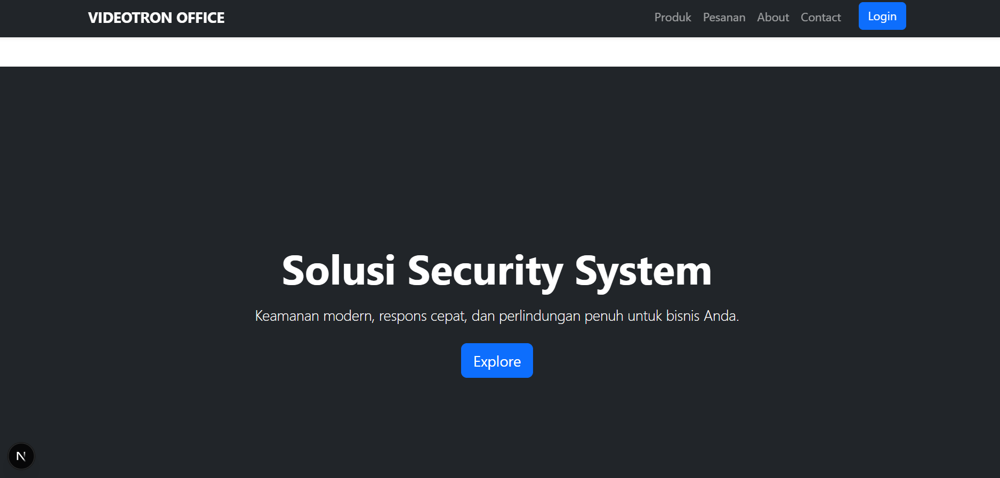
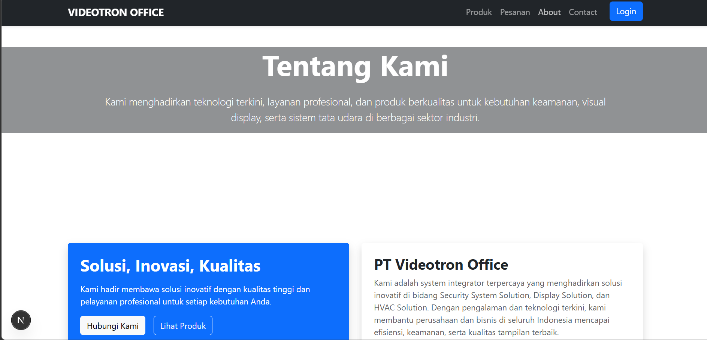
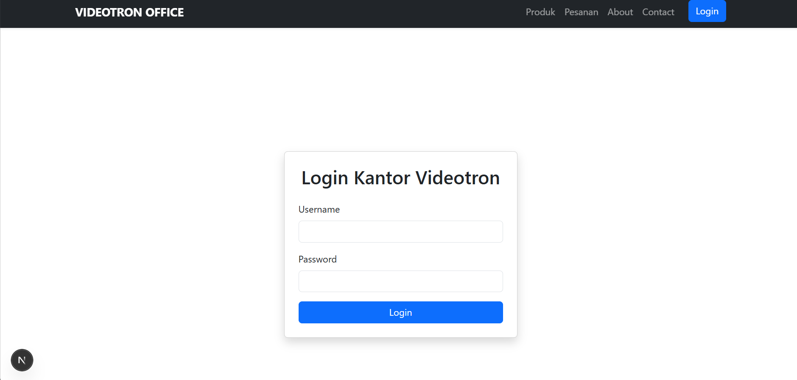
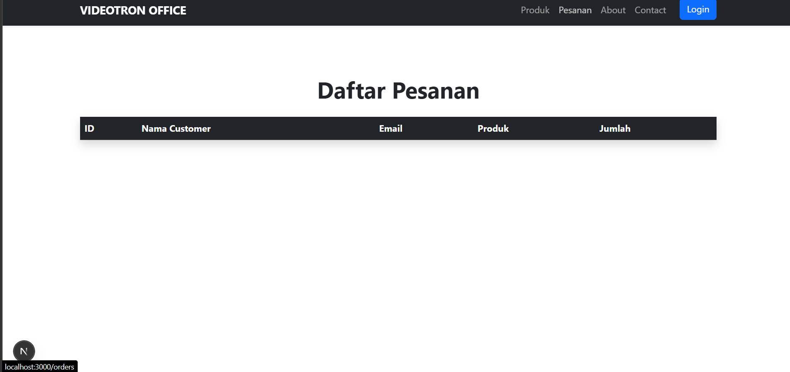
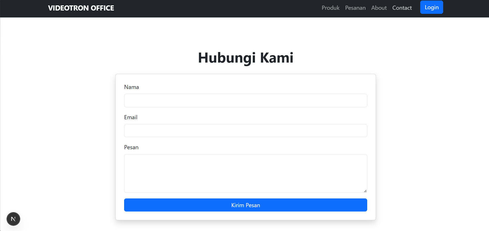

# Project UTS Web Enterprise

## Deskripsi
Website ini dibuat untuk memenuhi tugas UTS mata kuliah Web Enterprise.
Fitur yang tersedia:
- Halaman Home dengan hero section
- About, Login, Produk, Pesanan, Contact
- API routes (login, products, orders)
- Navbar responsif

## Screenshot









## Cara Menjalankan
1. Clone repository:
   ```bash
   git clone https://github.com/Nebulla001/-01-setup-environment-react.git
